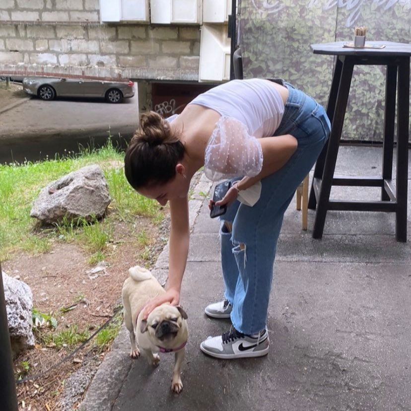

# Amina-Basic-Resume

    <!DOCTYPE html>
  <html lang="en"></html>
  <html>

  <head>

    <meta charset="utf-8">
    <title> Amina Basic - Resume </title>
    <!-- 
            Name: Amina Basic 
            Course: CS412 1&2
            Project: Resume 
            Due Date: 22.10.2021.
     -->
  </head>
  <body>

<h2 style="border: 3px solid grey;"><ins>Biography</ins></h2>

<blockquote>
<i>Life begins at then end of your comfort zone, that's why I'm doing this.</i>
</blockquote>

<figure>Just me and a dog</figure>

 I am Amina Basic. I am studying Software Engineering at the University of IUS. I applied for a scholarship and got <del>75%</del> at first, but changing my department decreased my sholarship to <ins>55%</ins>. Aside from that, in my spare time I like to write articles and volunteer for the Red Cross. Writing is my passion. As we are speaking of passion, I love people. Communicating, making new connections is all part of my personality which is necessary in todays world, especially business vise.  

<h2 style="background-color: thistle; border: 2px solid violet;"> My Education</h2>

<ol> 

   <li><b>Middle School:</b> Grbavica 1</li>
   <li><b>High School: </b> International High School Sarajevo 2015-2017</li>
   <li><b>High School:</b> Prva gimnazija 2017-2019</li>
   <li><b>University:</b> International University of Sarajevo <acronym title="International University of Sarajevo"><b>(IUS)</b></acronym></li>

</ol>

<h2 style="background-color: thistle; border: 2px solid violet;">My Skills</h2>

<ul type= "square">
  
    <li><b>Writing</b></li> 
    

    

       As writing has been my long-term hobby, I have decided to use this to gain a part time job. Today, I have been actively writing articles as a freelancer for a private company called "Web Factory" for 8 months. The main themes I have conducted my research upon are: 

       <ul style:"list-style-type:circle">
       <li>WordPress</li>
       <li>Web Design</li>
       <li>E-commerce</li>
       <li>Affiliate Marketing</li>
       <li>Marketing</li></ul>
        
    

    <li><b>Languages</b></li>

    

       From High School I have been actively studying languages. In my 4th year I came along winning third place in an annual competition from English. Some other languages I learned are: <i>Italian</i>, German, English (as I said) and Bosnian as my native language 

    

    <li><b>Communication skills</b></li>
    <li><b>People skills</b></li>
    <li><b>Creativity</b></li>
    <li><b>Adiministrative skills</b></li>

</ul>

<h2 style="background-color: thistle; border: 2px solid violet">Contact me</h2>

<ul style:"list-style-type:square">

<li><b>Phone number:</b> +38762870632</li>
 
<li><b>Email:</b> <a href=" mailto: basiccamina@gmail.com ">Contact me straight away</a></li>
 
<li><b>Linkedin:</b> <a href="https://www.linkedin.com/in/amina-basic-783246220/Amina">Amina Basic</a></li>
</ul>

</body>
</html> 
